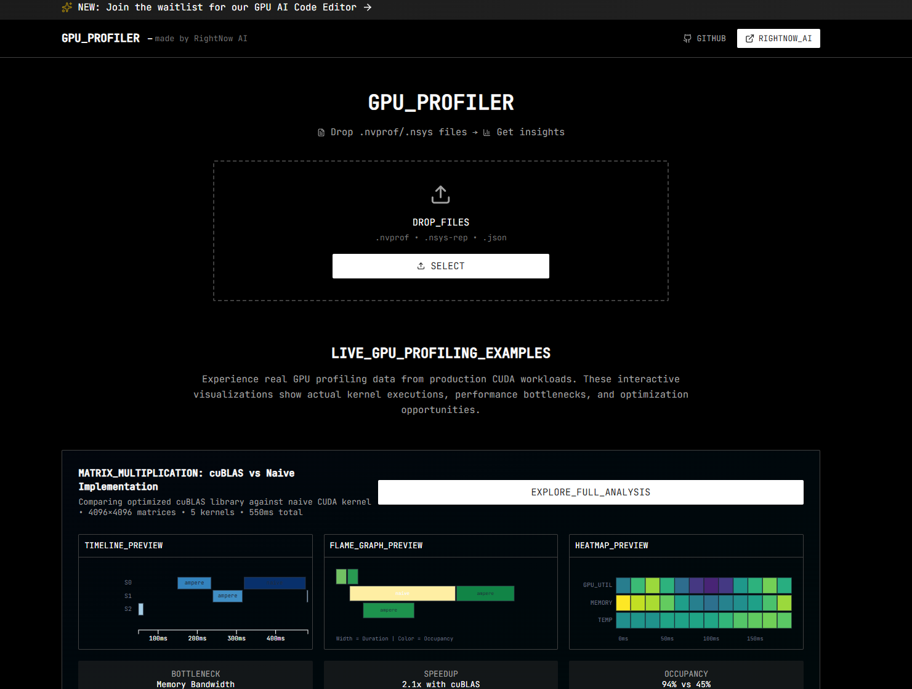
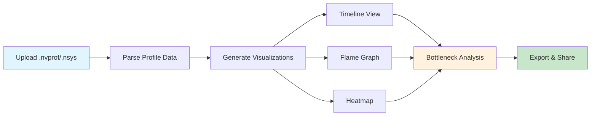

# GPU Profiler

[](https://github.com/RightNow-AI/gpu-profiler/releases)
[](https://nextjs.org)
[](https://typescriptlang.org)
[](https://discord.com/invite/sSJqgNnq6X)
[](LICENSE)

**Open-source web-based GPU performance visualization tool that transforms NVIDIA profiling data into interactive insights for CUDA engineers.**

> Part of the [RightNow AI](https://www.rightnowai.co/) ecosystem. Want 180x more powerful AI assistance for your entire codebase? Try [RightNow AI Code Editor](https://www.rightnowai.co/).

---

## Quick Start

```bash
# Clone and install
git clone https://github.com/RightNow-AI/gpu-profiler.git
cd gpu-profiler
npm install

# Start development server
npm run dev

# Open http://localhost:3000 and drop your .nvprof files!
```

## Live Demo

**[Try GPU Profiler](https://profiler.rightnowai.co)** - Upload your profiling files instantly

## Demo



## Features

- **Interactive Visualizations** - Timeline, flame graphs, and heatmaps powered by D3.js
- **Multiple Format Support** - .nvprof, .nsys-rep, and .json profiling files
- **Real-time Analysis** - Client-side processing for instant results
- **Bottleneck Detection** - AI-powered hints for performance optimization
- **Shareable Results** - Generate links to share profiling insights
- **Export Capabilities** - JSON, CSV, and Chrome Tracing format export
- **Professional UI** - Clean, modern interface with JetBrains typography

## How It Works



1. **Upload** - Drop your NVIDIA profiling files (.nvprof, .nsys-rep, .json)
2. **Parse** - Client-side processing extracts kernel launches and GPU metrics
3. **Visualize** - Interactive timeline, flame graphs, and utilization heatmaps
4. **Analyze** - AI-powered bottleneck detection and optimization hints
5. **Share** - Export results or generate shareable links

## Installation

### Requirements

- Node.js 18+
- NPM or Yarn
- Modern web browser (Chrome, Firefox, Safari, Edge)

### Setup

```bash
# Clone repository
git clone https://github.com/RightNow-AI/gpu-profiler.git
cd gpu-profiler

# Install dependencies
npm install

# Start development server
npm run dev

# Build for production
npm run build
npm start

# Verify installation at http://localhost:3000
```

## Architecture

```
app/
├── components/           # React components
│   ├── visualizations/  # D3.js visualization components
│   ├── file-upload.tsx  # Drag & drop upload
│   └── profiler-interface.tsx
├── lib/
│   ├── parsers/         # File format parsers
│   ├── utils.ts         # Utility functions
│   ├── sharing.ts       # URL sharing logic
│   └── export.ts        # Export functionality
├── store/               # Zustand state management
├── types/               # TypeScript definitions
└── globals.css          # Tailwind + custom styles
```

### Key Technologies

- **Next.js 15** - React framework with App Router
- **TypeScript** - Type safety and developer experience
- **D3.js** - Data-driven visualizations
- **Tailwind CSS** - Utility-first styling
- **Zustand** - Lightweight state management
- **Lucide React** - Clean, consistent icons

## Performance

- **Client-side processing** - No data leaves your browser
- **Efficient parsing** - Handles large profiling files (up to 100MB)
- **Optimized renders** - Smooth interactions even with thousands of kernels
- **Memory efficient** - Smart data compression for sharing

## Privacy & Security

- **100% client-side** - Your profiling data never leaves your device
- **No tracking** - We don't collect any analytics or personal data
- **Secure sharing** - Shared links use URL-safe encoding
- **Open source** - Full transparency, audit the code yourself

## Contributing

We welcome contributions! Please see our [Contributing Guide](CONTRIBUTING.md) for details.

### Development Workflow

1. Fork the repository
2. Create a feature branch: `git checkout -b feature/amazing-feature`
3. Make your changes
4. Run tests: `npm test`
5. Commit: `git commit -m 'Add amazing feature'`
6. Push: `git push origin feature/amazing-feature`
7. Open a Pull Request

### Reporting Issues

Found a bug or have a feature request? [Open an issue](https://github.com/rightnow-ai/gpu-profiler/issues/new) with:
- Clear description of the problem
- Steps to reproduce
- Expected vs actual behavior
- Sample profiling file (if applicable)

## Roadmap

### v1.1 (Next Release)
- [ ] **Live profiling** - Connect to ncu/nsys running locally
- [ ] **WebGPU support** - Chrome WebGPU trace compatibility  
- [ ] **Multi-file comparison** - Compare multiple profiling sessions
- [ ] **Advanced filters** - Filter kernels by occupancy, duration, etc.

### v1.2 (Future)
- [ ] **AI optimization** - Integration with RightNow AI's CUDA analyzer
- [ ] **Code mapping** - Upload kernel source code for line-by-line analysis
- [ ] **Collaborative features** - Team workspaces and annotations
- [ ] **API access** - Programmatic access for CI/CD integration

## Enterprise

Need advanced features for your team? [RightNow AI](https://rightnow.ai) offers:
- **Live inline profiling** in the AI-powered code editor
- **Custom optimization rules** for your specific kernels
- **Advanced AI analysis** with natural language explanations
- **Team collaboration** features and workspace management

## Performance Features

GPU Profiler provides comprehensive performance insights:

| Category | Features |
|----------|-----------|
| **Kernel Analysis** | Execution time, occupancy, register usage, memory throughput |
| **Memory Profiling** | Transfer patterns, bandwidth utilization, cache efficiency |
| **Bottleneck Detection** | AI-powered optimization suggestions and performance hints |
| **Visual Analytics** | Interactive charts, zoom capabilities, data export |

## Contributing

We welcome contributions! See [CONTRIBUTING.md](CONTRIBUTING.md) for guidelines.

## License

MIT License - free for personal, educational, and commercial use.

## Links

- **Website**: [www.rightnowai.co](https://www.rightnowai.co/)
- **GPU Profiler**: [profiler.rightnowai.co](https://profiler.rightnowai.co)
- **Documentation**: [docs.rightnowai.co](https://docs.rightnowai.co/)
- **Discord**: [Join our community](https://discord.com/invite/sSJqgNnq6X)
- **Twitter/X**: [@rightnowai_co](https://twitter.com/rightnowai_co)

---

<p align="center">
Made with love by the <a href="https://www.rightnowai.co/">RightNow AI</a> Team
</p>
